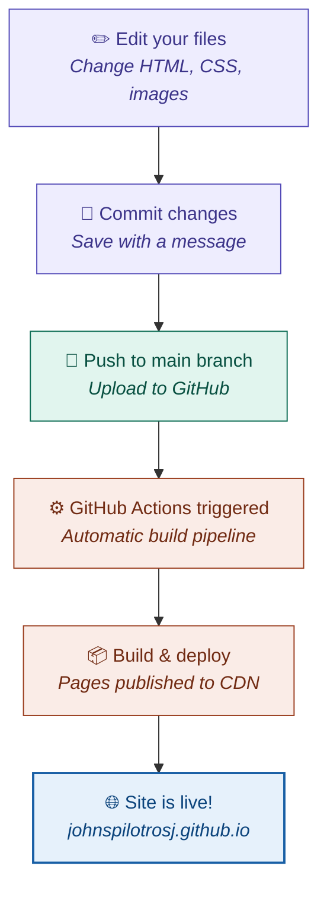

# Setup by Ethan Gardner
When you push changes to this repository, GitHub Pages automatically builds and deploys your site. Here's the full process:



> **Purple** = your actions &nbsp;|&nbsp; **Green** = Git &nbsp;|&nbsp; **Orange** = CI/CD pipeline &nbsp;|&nbsp; **Blue** = live site

## Quick start

1. Click the **Edit site** button on the welcome page (or go to this repo directly)
2. Edit `index.html` — change text, colors, or add new sections
3. Commit your changes to the `main` branch
4. GitHub Actions will automatically build and deploy your updated site
5. Your changes go live at `https://johnspilotrosj.github.io` within a few minutes

## File structure

```
├── index.html          # The welcome page (everything in one file)
├── README.md           # This file
```

## Customization tips

**Change the greeting** — Find `Hello, <em>John</em>.` in the HTML and swap in whatever you like.

**Change colors** — Edit the CSS variables in the `:root` block at the top of the `<style>` section. The three accent colors (purple, teal, coral) control the background orbs and highlights.

**Add new sections** — Copy the hero section structure and add content below it. The existing animations and styles will carry over.

**Dark mode** — The site automatically adapts to the visitor's system preference. Both palettes are defined in the CSS variables — the `@media (prefers-color-scheme: dark)` block handles the switch.

## Credits

Designed & developed by **Ethan Gardner**
